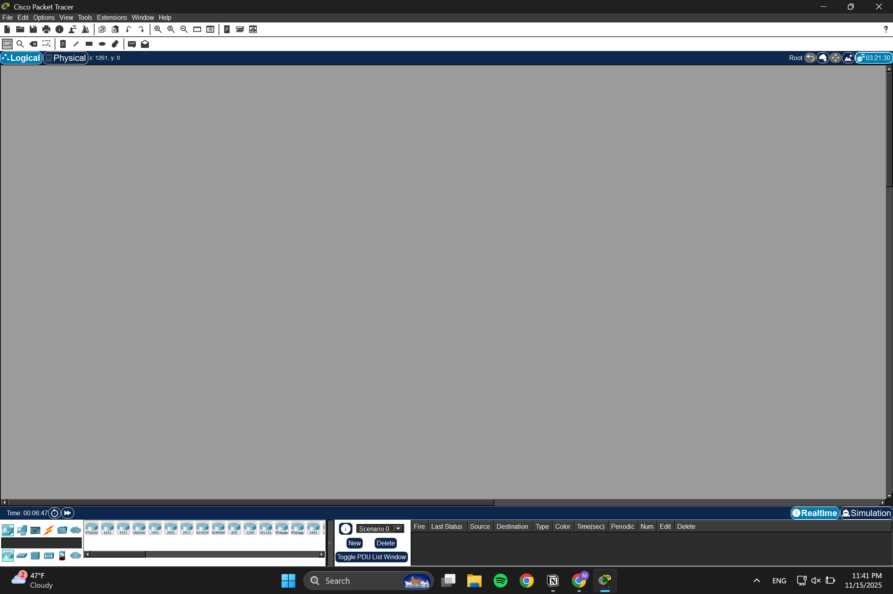
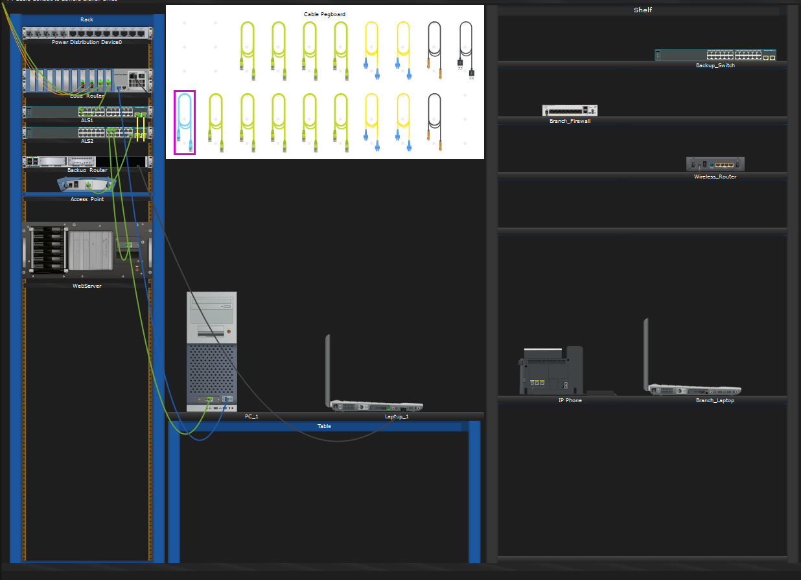
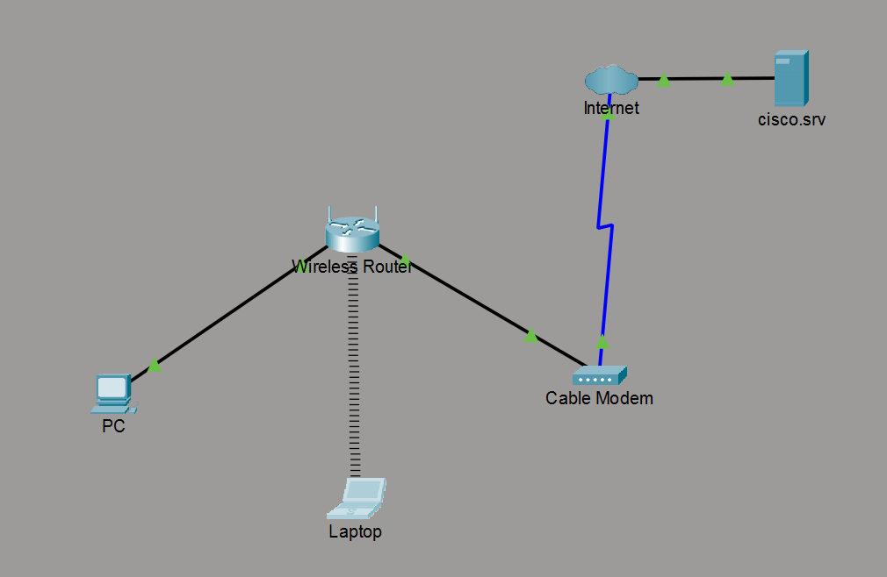

# Cisco Packet Tracer
https://www.netacad.com/cisco-packet-tracer

11/15/25  
Started this training course! I downloaded and launched the software.

Here are a number of things that can be done using this software:
1) Simulate network
2) Play with rack mount and cable equipment
3) Design, plan, and test IP addresses and schemes
4) Configure wireless devices and security
5) Configure and program wireless devices
6) Build and test smart home components
7) Watch data flow across and view detailed packet information
8) Build a simple or complex topology from scratch

11/16/25

Here I created a simple, small home network with a home router, wireless laptop, wired PC, and front door camera!  
The two tabs open allowed me to customize the configurations of each of the devices.  
I customized the laptop by changing it from a wired connection to a wireless connection by installing the WPC300N module onto the laptop.

11/18/25

Here I am working with a packet tracer tutored activity (PTTA).  
I installed a backup router and connected a laptop to it.  
I then reconfigured the laptop's hostname to be "Edge_Backup_Router" using the endpoint's command line interface (CLI).  

The Cisco Packet Tracer software has the ability to produce 4 different types of files.
1) .pka files are "activity" files that have instructions and scoring
2) .pkt files are pre-built network simulations that have no instructions or scoring
3) .pksz files are exclusive to PTTA activities
4) .pkz files are depreciated file types originally meant to imbed images and other files in packet tracer files
  

Here I made a simple network that had a cable modem that connected to a server called "cisco.crv".  
There were 2 other end devices that were connected to a router.
I manually configured their connectivity, both wired and wireless using a copper straight-through cable.
